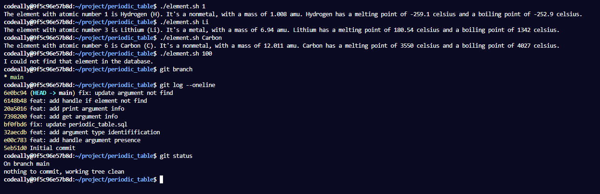

# FCC - Periodic Table Database


## Description

This is a interactive bash programm `( salon.sh )` that return informations about a specific element such as his `type`, `atomic mass`, `melting point temperature` or `boiling point temperature`.

Either a `name`, a `symbol` or an `element number` needs to be provided while running the script like:

```
./element.sh Carbon
```

```
./element.sh Li
```

```
./element.sh 1
```

This project is part of the **[freeCodeCamp](https://www.freecodecamp.org/learn/relational-database/build-a-periodic-table-database-project/build-a-periodic-table-database)** Relation Database projects certification.

## Example outputs

<p align="center">
    
</p>
